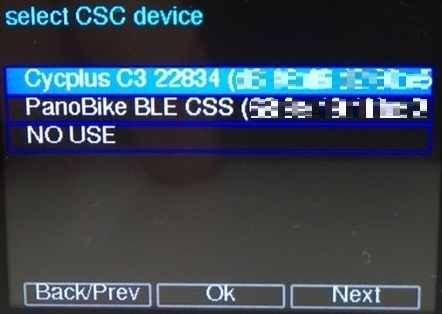

# M5StackBleCentral
English | [日本語](README_ja.md)

Work on M5Stack. Using the NimBLE library, a BLE central device that can connect CSC peripherals (cadence sensor, etc.) and HID peripherals (remote shutter, etc.). 

## Requirement
Required library.

* M5Stack (version=0.3.1 author=M5Stack)
* FunctionFsm (version=1.0.0 author=JRVeale)
* M5Stack_OnScreenKeyboard (version=0.3.4 author=lovyan03)
* M5Stack_TreeView (version=0.2.14 author=lovyan03)
* NimBLE-Arduino (version=1.2.0 author=h2zero)

## Design

State Machine  used to manage complex operating states.

## Usage

When started, it scans the advertised peripheral and displays the device list screen for the user to select.

Select the CSC device and the HID device in order.

Once the selection is complete, the device will be registered internally and will automatically connect to the peripheral from the next boot.

If you want to select the peripheral again, press the button at startup to initialize the internal registration.

## Implementation
The current source code updates the indicators on the screen when it receives a Notify from the peripheral.
It is good to add necessary functions such as output to GPIO to this location (around updateIndicator () processing in keepconnect state).

## License

MIT License

## Copyright

Naohisa Fukuoka, 2021
