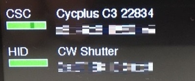
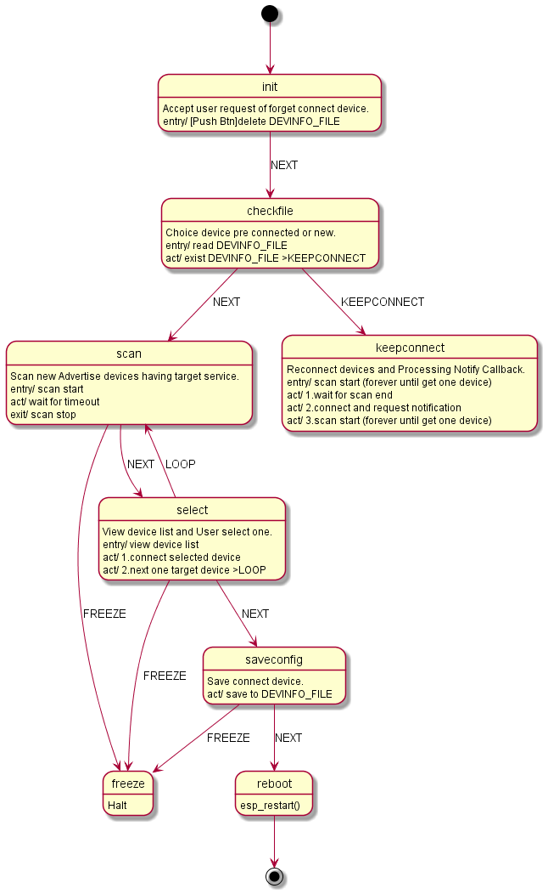
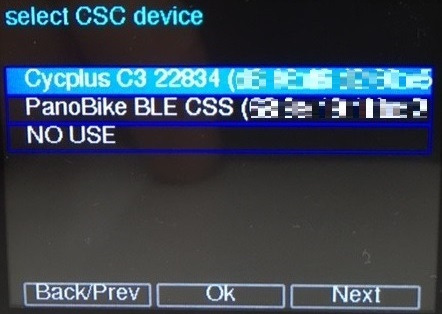
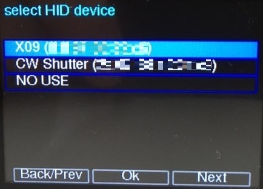

# M5StackBleCentral
[English](README.md) | 日本語

NimBLEライブラリを使って、CSCペリフェラル(ケイデンスセンサー等)とHIDペリフェラル(リモートシャッター等)を同時に接続できるBLEセントラルデバイスをM5Stackで動作させるものです。

## Requirement
動作には以下のライブラリが必要です。  

* M5Stack (version=0.3.1 author=M5Stack)
* FunctionFsm (version=1.0.0 author=JRVeale)
* M5Stack_OnScreenKeyboard (version=0.3.4 author=lovyan03)
* M5Stack_TreeView (version=0.2.14 author=lovyan03)
* NimBLE-Arduino (version=1.2.0 author=h2zero)

## Design

複雑な動作状態を管理するため、ステートマシンを使用しています。

## Usage

起動するとAdvertiseしているペリフェラルをscanしてユーザに選択してもらうためのデバイス一覧画面を表示します。

CSCデバイスとHIDデバイスについて順に選択します。

選択完了したらデバイスが内部に登録され、次回起動からは自動的にペリフェラルに接続します。

再度ペリフェラルを選択したいときには、起動時にボタンを押しておくと内部の登録を初期化します。

## Implementation
現在のソースコードは、ペリフェラルからのNotifyを受信した時、画面のインジケーターを更新しているだけです。
この場所(keepconnect状態中のupdateIndicator()処理辺り)に、GPIOへの出力等必要な機能を追加すると良いです。

## License

MIT License

## Copyright

Naohisa Fukuoka, 2021
